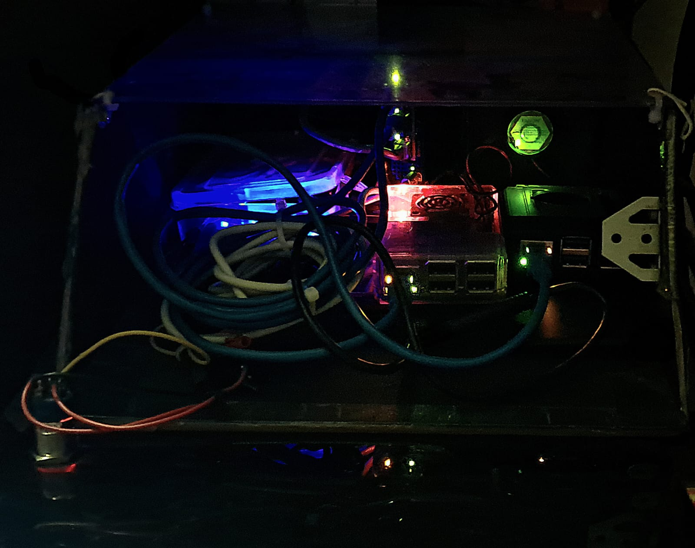

# Home-Server

## Overview
This repository documents my journey of building a **home server** that hosts multiple services, including:
- **Network Attached Storage (NAS)** – Centralized file storage and sharing.
- **Home Assistant** – Smart home automation and monitoring.
- **CCTV Server (MotionEye)** – Security camera streaming and recording.
- **Network Ad Blocker (Pi-hole)** – Blocks unwanted ads and trackers across all devices.
- **VPN (Tailscale)** – Secure remote access to the home network.
- **Containerized Services (Portainer)** – Easy management of Docker containers.
- **Custom Monitoring Dashboard** – Tracks system metrics, temperatures, and performance.

The server is designed for reliability, low power consumption, and expandability, leveraging Raspberry Pis and open-source software.

Ignore the wire mess — 😅

## Hardware Setup
### Core Components:
- **Raspberry Pi 3B** – Running Home Assistant.
- **Raspberry Pi 5** – Running Tailscale, Pi-hole, MotionEye, Portainer, and OpenMediaVault (NAS).
- **MikroTik Switch** – Connects both Raspberry Pis via Ethernet for better network performance.
- **An old 450W ATX Power Supply** – Modified to power the system.

## Software Stack
The home server runs various services to enhance functionality:
- **Operating Systems:** Raspberry Pi OS / Debian-based distros [Used Raspbian in the Pi 5].
- **Home Assistant:** Smart home integration and automation. [Used HAOS in the Pi 3B]
- **Pi-hole:** DNS-based ad blocking.
- **MotionEye:** Surveillance and camera management.
- **Tailscale:** Encrypted remote access via WireGuard VPN.
- **OpenMediaVault:** NAS management and file sharing.
- **Portainer:** Simplifies containerized applications.

## Features & Goals
- **Self-Hosted & Private** – All data is locally stored, minimizing reliance on cloud services.
- **Scalability** – Can add more storage or services as needed.
- **Energy Efficient** – Low-power devices ensure minimal electricity consumption.
- **Remote Access** – Secure VPN-based access to services when away from home.
- **Automated Monitoring** – Tracks system temperature, network activity, and service health via Home Assistant.

## To-Do List
- [ ] Set up backup solutions for data redundancy.
- [ ] Set up power backup and power cut alerts.
- [ ] Implement automation scripts for system maintenance.

## Contributing
This is a personal project, but suggestions and improvements are always welcome! Feel free to open issues or contribute via pull requests.

## License
This project is licensed under the MIT License – see the [LICENSE](LICENSE) file for details.
